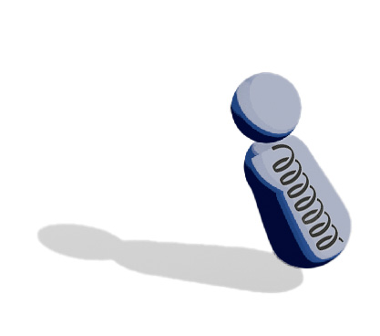

# Simple Mannequin Animator

A Blender add-on for quick spring-physics character animation using simple head + body objects.

Animate just the **head** — the body follows automatically, leaning back when accelerating and swinging forward when braking, driven by a real spring simulation.

---

## Features

- **Spring physics** — semi-implicit Euler simulation with tunable stiffness and damping
- **Inertia tilt** — body leans in the direction opposite to movement, angle scales with speed
- **Overshoot & oscillation** — body bounces naturally when stopping suddenly
- **Live preview** — updates every frame via Blender's frame-change handler
- **Multi-mannequin** — manage multiple independent characters in one scene
- **Quick build** — one click creates default sphere + cylinder reference objects

---

## Installation

1. Open Blender
2. **Edit → Preferences → Add-ons → Install from Disk**
3. Select `mannequin_follow_lag.py`
4. Enable the add-on — panel appears in **View3D → Sidebar → Mannequin**

Requires Blender 4.0+.

---

## Workflow

1. Click **Quick Default Objects** (or assign your own head/body meshes)
2. Set **Z Offset** so the body aligns below the head
3. Press **+** to add a mannequin to the list
4. Keyframe the **head object** — the body updates live
5. Tune **Tilt** and **Spring** sliders to taste
6. Use **Reset Springs** after large timeline jumps

---

## Parameters

| Parameter | Description |
|---|---|
| **Tilt Scale** | How far the body leans during movement |
| **Max Tilt °** | Hard clamp on tilt angle (0–90°) |
| **Delay Frames** | How many frames behind the body reacts |
| **Stiffness** | Spring snap — high = snappy, low = lazy |
| **Damping** | Oscillation decay — ~1.0 = no bounce, < 0.3 = many swings |
| **Tilt ×** | Per-mannequin sensitivity multiplier |
